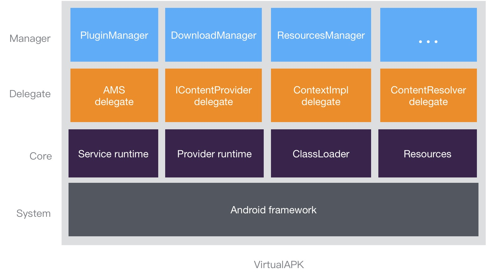

# VirtualAPK
VirtualAPK is a plugin framework for Android, it can load an apk file dynamically, then the loaded apk file which is called LoadedPlugin by us can be treated as applications installed.

through VirtualAPK, Developers can visit Class and Resources in LoadedPlugin, more important, can visit Android components(Activity/Service/Receiver/Provider) just like they are installed.


# Feature supported

|Feature|Detail
|:-------------|:-------------:|
| Supported components |Activity / Service / Receiver / Provider
| Components need to register in AndroidManifest.xml |Not needed
| Plugin can depend on host app| Yes
| Support PendingIntent| Yes
| Supported Android features| Almost all features
| Compatible devices| Almost all devices
| How to build plugin apk |Gradle plugin
| Supported Android versions |API 15 +
# Getting started
### Host Project
Add the following dependency in the build.gradle in root path of host project:
``` java
dependencies {
    classpath 'com.didi.virtualapk:gradle:1.1.4'
}
```

Apply plugin in the build.gradle of application module:
```
apply plugin: 'com.didi.virtualapk.host'
```

Add the following dependency in the build.gradle of application module:
``` java
compile 'com.didi.virtualapk:core:1.1.4.5'
```

Then add initial code in attachBaseContext method of application:
``` java
@Override
protected void attachBaseContext(Context base) {
    super.attachBaseContext(base);
    PluginManager.getInstance(base).init();
}
```

Now, you can load an apk as you wish, for example:

``` java
String pluginPath = Environment.getExternalStorageDirectory().getAbsolutePath().concat("/Test.apk");
File plugin = new File(pluginPath);
PluginManager.getInstance(base).loadPlugin(plugin);

//suppose "com.didi.virtualapk.demo" is the package name of plugin apk.
Intent intent = new Intent();
intent.setClassName("com.didi.virtualapk.demo", "com.didi.virtualapk.demo.MainActivity");
startActivity(intent);
```
### Plugin Project
Add the following dependency in the build.gradle in root path of plugin project:
``` java
dependencies {
    classpath 'com.didi.virtualapk:gradle:1.1.4'
}
```

Then apply plugin in the build.gradle of application module and config VirtualAPK.

Note : put the following code at the end of build.gradle
```
apply plugin: 'com.didi.virtualapk.plugin'
virtualApk {
    packageId = 0x6f // the package id of Resources.
    targetHost='source/host/app' // the path of application module in host project.
    applyHostMapping = true // optional, default value: true. 
}
```
# Develop guide
See the [Wiki](https://github.com/didichuxing/VirtualAPK/wiki).
# Known issues
- unsupport notifications with custom layout in plugin
- unsupport transition animations with animation resources in plugin

# Contributing
Welcome to contribute to VirtualAPK, you can contribute issues or pull requests, see the [Contributing Guide](CONTRIBUTING.md).

# License
VirtualAPK is under the BSD license. See the [LICENSE](LICENSE) file.
